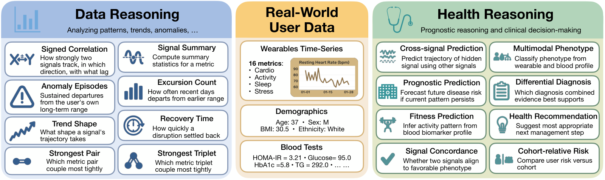

# WearableQA: A Benchmark for Health Reasoning over Real-World Wearable Data

[](https://arxiv.org/abs/2609.05405)
[](https://huggingface.co/datasets/facebook/WearableQA)
[](LICENSE)

**WearableQA** is a benchmark of **4,084 ten-option multiple-choice questions** built from the
wearable time series, blood biomarkers, and demographics of **200 real users**, each with up to
about 500 days of daily measurements. Unlike benchmarks built on synthetic or idealized signals, it
preserves authentic wearable distributions — device noise, missing days, and inter-individual
variability included.

Each question asks a model to reason over one user's longitudinal record: to compute over the raw
measurements, to interpret them physiologically, or both.



The 16 question types are organized along two complementary axes:

- **Data vs. health reasoning** — computing over longitudinal measurements (correlations, excursion
  counts, recovery times, trend shapes) versus interpreting them physiologically (risk assessment,
  differential diagnosis, prognostic prediction).
- **Single- vs. cross-signal reasoning** — reasoning within one metric versus integrating several.

| Axis | Split | Count |
|---|---|---|
| Reasoning group | data / health | 2,724 / 1,360 |
| Signal complexity | single / cross | 1,682 / 2,402 |
| Grounding | population / literature | 3,154 / 930 |

Ground-truth answers are balanced uniformly across options A–J within each reasoning group, so the
random baseline is 10%.

---

## What's in this repository

Three files, in two formats — a ready-to-use rendered dataset, and the structured source it is
rendered from.

| File | Size | What it is |
|---|---|---|
| `WearableQA.jsonl` | 306 MB | **Pre-rendered benchmark.** One question per line, prompt already flattened to text. Use this to evaluate. |
| `WearableQA_raw.json` | 39 MB | **Structured source.** Questions plus the full per-user time series, so you can render the data any way you like. |
| `render_raw.py` | 10 KB | Renderer that turns the structured source into a `.jsonl`, in any of four serializations. |

### 1. `WearableQA.jsonl` — the pre-rendered benchmark

4,084 lines, one JSON object per question. This is the file to use if you just want to run a model
against the benchmark: every prompt is already a single string, so no assembly is needed.

```json
{
  "id": "Lit_user_25_2024-08-06",
  "question": "You are given a user's demographics, wearable health sensor history, ...",
  "choices": {"A": "an elevated resting heart rate with low daily activity ...", "...": "..."},
  "answer": "A",
  "category": "fitness_prediction",
  "reasoning_group": "health",
  "signal": "cross",
  "grounding": "literature",
  "representation": "row"
}
```

| Field | Meaning |
|---|---|
| `id` | Unique question id (`<source>_<user>_<end-date>`) |
| `question` | The complete prompt: instruction, user profile, sensor history, blood panel, cohort percentiles, question stem, and options |
| `choices` | The ten options, keyed `A`–`J` |
| `answer` | Ground-truth option letter |
| `category` | One of the 16 question types |
| `reasoning_group` | `data` or `health` |
| `signal` | `single` or `cross` |
| `grounding` | `population` (derived from cohort statistics) or `literature` (derived from published relationships) |
| `representation` | Which sensor serialization this file was rendered with (`row` in the released file) |

The `question` string is assembled from these sections:

```
(instruction)
=== USER PROFILE ===                                age, sex, BMI, ethnicity
=== SENSOR DATA (row: one line per day) ===         up to ~500 days of daily metrics
=== BLOOD BIOMARKER PANEL ===                       17 biomarkers, where available
=== COHORT REFERENCE (population percentiles) ===   p10/p25/p50/p75/p90 for 5 metrics
=== QUESTION ===                                    the question stem
=== OPTIONS ===                                     A-J
```

Sections are omitted when they don't apply — some questions deliberately withhold the time series
so the model must reason from the blood panel alone, and some withhold the cohort reference.

Prompts are large: **median ~86k characters, max ~124k**. Budget context accordingly.

Up to 16 daily metrics appear per user: steps, resting HR, HRV, VO2 max, sleep duration, sleep
efficiency, deep %, REM %, bedtime standard deviation, active calories, BMR calories, average stress
level, exercise count, exercise hours, exercise METs, and exercise average HR. Real records are
sparse — a metric missing on a given day is simply absent from that day's row.

### 2. `WearableQA_raw.json` — the structured source

The same benchmark before rendering, so you can serialize the time series differently, feed the
numbers to a tool-using agent, or build your own prompt template.

```
{
  "description":       "...",
  "n_mcqs":            4084,
  "n_unique_users":    200,
  "gt_balancing":      "uniform A-J within each reasoning group (data / health)",
  "cohort_reference":  { "<metric>": {p10, p25, p50, p75, p90, _min, _max, ...} },   # 5 metrics
  "user_histories":    { "<user_id>": [ {date, <metric>: value, ...}, ... ] },       # 200 users
  "mcqs":              [ { ... }, ... ]                                              # 4,084 questions
}
```

Each entry in `mcqs` carries:

| Field | Meaning |
|---|---|
| `id`, `user_id` | Question id and the user it belongs to |
| `stem`, `options`, `gt_letter` | Question text, the ten options, ground-truth letter |
| `question_type`, `reasoning_group`, `signal`, `grounding` | Taxonomy labels |
| `context` | `demographics` and `blood_panel` for this user |
| `end_date` | Last day of the question's observation window |
| `window_size` | Length in days of the window the question asks about (28 throughout) |
| `full_dropped_metrics` | Metrics deliberately withheld from this question |
| `no_cohort` | Whether the cohort reference is withheld |

`user_histories` holds each user's **complete** record — the
renderer slices out the window each question needs. Rendering a question takes the 28-day
observation window plus up to 500 days of prior history for context.

### 3. `render_raw.py` — the renderer

Rebuilds a `.jsonl` from the structured source. With no arguments it reproduces the released
`WearableQA.jsonl` **byte-for-byte** (verified: md5 `82bb783e147db78501d35ffab4a5392f`).

```bash
# Regenerate the released file (row format)
python3 render_raw.py

# Render the sensor data a different way
python3 render_raw.py --format markdown --out WearableQA_markdown.jsonl
python3 render_raw.py --format csv      --out WearableQA_csv.jsonl
python3 render_raw.py --format col      --out WearableQA_col.jsonl
```

| Flag | Default | Meaning |
|---|---|---|
| `--data` | `WearableQA_raw.json` | Structured source file |
| `--format` | `row` | `row`, `col`, `csv`, or `markdown` |
| `--out` | `WearableQA.jsonl` | Output path |

Only the `=== SENSOR DATA ===` block changes between formats; everything else in the prompt is
identical.

**`row`** — one line per day, sparse (absent metrics omitted):

```
2023-10-20: Active Cal=1255, Stress=21.0, Deep%=30.7, RHR=38.0, Sleep(h)=5.05, Steps=27858, ...
2023-10-21: Active Cal=831.0, Stress=29.0, RHR=39.0, Steps=25463, VO2max=54.0
```

**`col`** — one block per metric, showing each metric's trajectory together:

```
Active Cal: 2023-10-20=1255, 2023-10-21=831.0, 2023-10-22=989.0, 2023-10-23=575.0, ...
```

**`csv`** — dense table, missing values as empty fields:

```
date,Active Cal,Stress,Deep%,RHR,Sleep(h),Steps,VO2max
2023-10-20,1255,21.0,30.7,38.0,5.05,27858,54.0
2023-10-21,831.0,29.0,,39.0,,25463,54.0
```

**`markdown`** — the same table in markdown.

The choice matters: in our experiments the serialization moved accuracy by several points, and
image-based renderings of the same data were far worse than any text form.

Output sizes differ substantially — `csv` is about 132 MB, `row` 306 MB, `col` 330 MB — because
sparse formats repeat metric names while dense formats repeat delimiters.

`render_raw.py` requires **Python 3 only** — no third-party dependencies.

---

## Getting the data (Git LFS)

The dataset files are stored with [Git LFS](https://git-lfs.com). **Install LFS before cloning**, or
you will get small text pointer files instead of the data.

```bash
# One-time, per machine
git lfs install

git clone https://github.com/facebookresearch/WearableQA.git
cd WearableQA
```

Already cloned without LFS? Fetch the real files with:

```bash
git lfs pull
```

To check you have the actual data rather than pointers:

```bash
$ ls -lh WearableQA.jsonl        # should be ~306M, not ~134 bytes
$ head -c 60 WearableQA.jsonl    # should be JSON, not "version https://git-lfs..."
```

If you only want the structured source and not the 306 MB rendered file, clone without fetching LFS
content and pull just the file you need:

```bash
GIT_LFS_SKIP_SMUDGE=1 git clone https://github.com/facebookresearch/WearableQA.git
cd WearableQA
git lfs pull --include="WearableQA_raw.json"
python3 render_raw.py            # rebuild the rendered file locally
```

---

## Quick start

The dataset is also on the Hugging Face Hub, which is the quickest way to get it — no clone, no LFS
setup:

```python
from datasets import load_dataset

ds = load_dataset("facebook/WearableQA", split="test")

ds[0]["question"]   # the complete prompt, ready to send to a model
ds[0]["choices"]    # {"A": ..., ..., "J": ...}
ds[0]["answer"]     # "A"
```

The Hub copy also carries the other three sensor serializations and a `structured` config that gives
you the raw values instead of a rendered prompt:

```python
load_dataset("facebook/WearableQA", "markdown", split="test")     # a different serialization
load_dataset("facebook/WearableQA", "structured", split="test")   # build your own prompts
```

Working from the files in this repository instead:

```python
import json

with open("WearableQA.jsonl") as f:
    questions = [json.loads(line) for line in f]

print(len(questions))                       # 4084

q = questions[0]
prompt = q["question"]                      # ready to send to a model
gold = q["answer"]                          # e.g. "A"

# Evaluate on a slice of the taxonomy
health = [q for q in questions if q["reasoning_group"] == "health"]
cross  = [q for q in questions if q["signal"] == "cross"]
```

We score an answer correct only when the model's chosen letter matches `answer`; responses with no
parseable letter count as incorrect.

---

## Citation

```bibtex
@misc{lee2026wearableqa,
      title={{WearableQA}: A Benchmark for Health Reasoning over Real-World Wearable Data},
      author={Ji Soo Lee and Xilun Chen and Pierce Chuang and Ashish Shenoy and Jason Wei and Dohwan Ko and Hyunwoo J. Kim and Benoit Corda},
      year={2026},
      eprint={2609.05405},
      archivePrefix={arXiv},
      primaryClass={cs.CL},
      url={https://arxiv.org/abs/2609.05405},
}
```


---

## License

The data is licensed under Creative Commons Attribution-Non Commercial 4.0
International (CC BY-NC 4.0), and subject to the following additional terms:
(i) No re-identification or attempted re-identification; (ii) No use in
connection with clinical, diagnostic, or treatment decisions; (iii) No use in a
manner that is discriminatory, harmful, or misleading with respect to
health-related outcomes; (iv) The Dataset is provided "as is", without
warranties of any kind, whether express or implied, including without
limitation accuracy, completeness, or fitness for a particular purpose, and is
provided for research and benchmarking purposes only.

See [LICENSE](LICENSE) for the full text.
